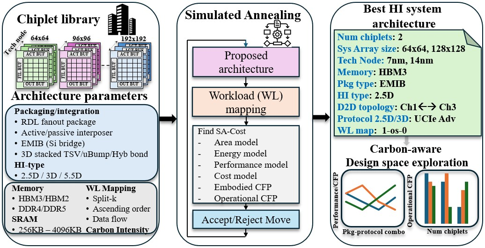
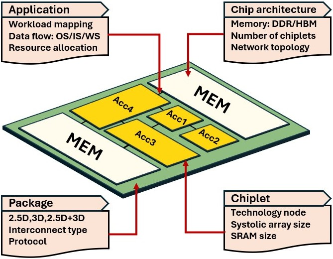
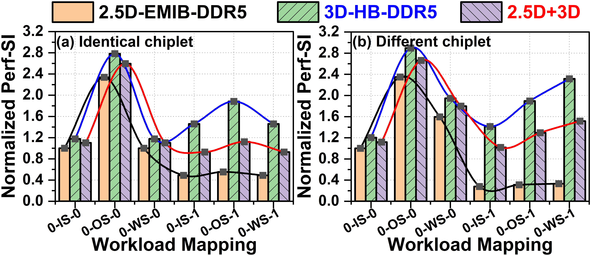
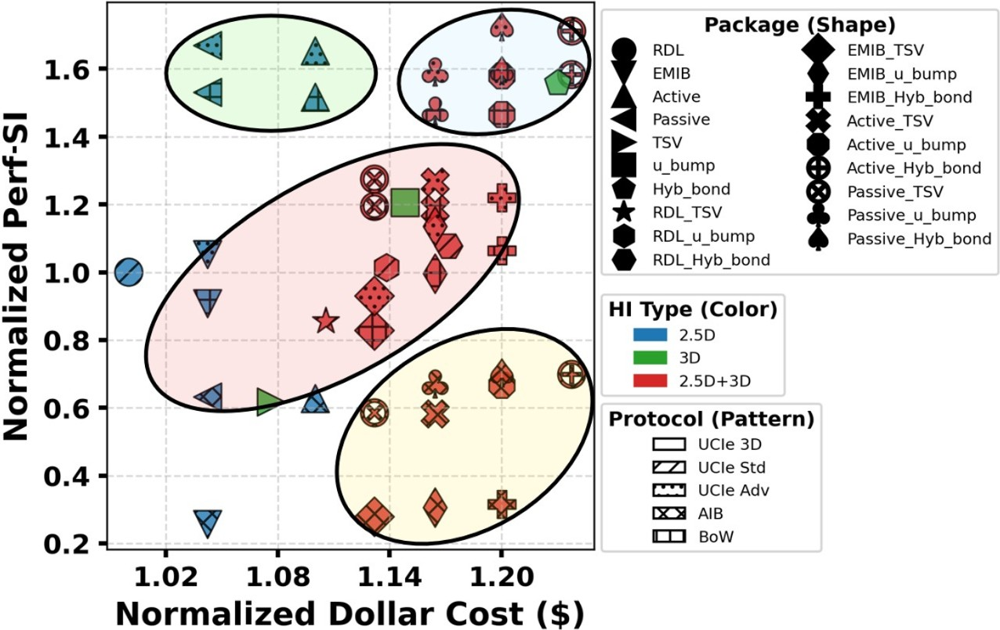

# CarbonPATH: Carbon-aware pathfinding and architecture optimization for chiplet-based AI systems

As chiplet-based accelerators and advanced packaging become mainstream for scaling DNN performance, **early design decisions**—spanning **workload mapping, architecture, chiplets, and packaging**—increasingly determine not only power, performance, and cost, but also the overall carbon footprint. As a result, **full-stack pathfinding frameworks** that jointly optimize PPAC and embodied + operational carbon are becoming essential to identify **robust, sustainability-aware accelerator configurations**.

This work introduces **CarbonPATH, an early-stage design and optimization framework that integrates embodied and operational carbon accounting** into the exploration of **chiplet-based accelerator architectures**. CarbonPATH enables **true system-level co-design across the full stack**, spanning:

- **Application-level decisions**: **workload mapping, dataflow** (e.g., **OS/IS/WS**), and **resource allocation**

- **Chip-architecture choices**: **memory type (DDR/HBM), chiplet count,** and **network topology**

- **Chiplet configuration parameters**: **technology node, systolic-array sizing,** and **SRAM capacity**

- **Package-level integration + interconnect: 2.5D / 3D / 2.5D+3D, protocol selection,** and **interconnect type**

By jointly modeling these interdependent choices, CarbonPATH supports systematic trade-off analysis across performance, cost, and carbon.


<p align="center">

<br/>
  <em>CarbonPATH framework overview.</em></figcaption>
</p>

<p align="center">

<br/>
  <em>System level co-design.</em></figcaption>
</p>


## Table of Contents 
-   [File structure](#file-structure)
-   [Getting started](#getting-started)
-   [Input parameters and configuration](#input-parameters-and-configuration)
-   [Running CarbonPATH](#running-carbon-path)
-   [Outputs and analysis](#outputs-and-analysis)


## File structure 
- [cfg](./cfg/)
- [chiplet](./chiplet/) 
- [config.py](./config.py)
- [main.py](./main.py)
- [Makefile](./Makefile)
- [script](./script/)
- [system](./system/)


## Getting started
### Prerequisites 

CarbonPATH requires the following: 
- python 3.9.18 
- pip 23.2.1
- python 3.9-venv


Additionally, please refer to the requirements.txt file in this repository. The packages in requirements.txt will be installed in a virtual environment.


### Download and install with bash 
```
Download the repo from https://github.com/ASU-VDA-Lab/CarbonPATH 
cd CarbonPATH
python3 -m venv carbonpath
source carbonpath/bin/activate
pip3 install -r requirements.txt
```

## Input parameters and configuration

### Parameters
CarbonPATH utilizes parameters and configurations stored in the cfg directory. The core parameters for the framework are located in the **cfg/parameter** folder. Below is a list of the various JSON files along with their details. The primary file that users need to modify is [input.json](./cfg/parameters/input.json), as it defines the overall search space for CarbonPATH. In addition to this, several other parameter files are available, as listed below:

```
cfg/parameters/
├── base_spec_7nm.json      [area and power for different systolic arrays at 7nm]
├── base_spec_sram_7nm.json [area and energy for different SRAM sizes at 7nm]
├── bonding_yield.json      [bonding yield for different package types]
├── cost_profiles.json      [weight factors for different optimization profiles]
├── d2d_input.json          [die-to-die datarate, efficiency, pitch information]
├── energy_eff.json         [die-to-die protocol and DRAM energy efficiency]
├── freq_scale.json         [frequency scale across tech nodes]
├── input.json              [main parameter file that defines the search space of PATH-AI]
├── mem_bw.json             [memory bandwidth for different systolic arrays]
├── scaling.json            [area and power scaling for logic]
├── sram_energy.json        [sram energy values and sram energy scaling]
└── sram_scaling.json       [sram area and energy scaling]

chiplet/carbon_model/arch_params/
├── architecture.json       [details of each chiplet]
├── designC.json            [design CFP parameters - architecture power, volume, design iterations]
├── operationalC.json       [operational CFP - lifetime value]
└── packageC.json           [parameters related to 2.5D/3D/2.5D+3D packages]
```
Users can input different parameters of their choice by modifying the above parameter files. CarbonPATH models the overall HI-system's area, power, energy, cost, embodied CFP, operational CFP, and cycle-accurate latency using data from the above JSON files. 

CarbonPATH also supports multiple optimization templates: ```t1, t2, t3, and t4``` ([cost_profiles.json](./cfg/parameters/cost_profiles.json)). Users can additionally customize the weight of various metrics according to their preferences. Embodied and operational carbon are still calculated and reported, but their profile coefficients are currently set to zero, so they do not affect the optimization score.

### Calibration
Since the metrics used by CarbonPATH have different units and scales, normalization is necessary to prevent any single term from dominating the SA-Cost function. The files below contain an example calibration.json for all the six different workloads used in the paper. 
```
cfg/calibration/
├── calibration_1.json [calibration for WL1]
├── calibration_2.json [calibration for WL2]
├── calibration_3.json [calibration for WL3]
├── calibration_4.json [calibration for WL4]
├── calibration_5.json [calibration for WL5]
└── calibration_6.json [calibration for WL6]
```
Command to run calibration on a particular workload is shown below, by default it runs for 10,000 samples. You can modify ``` calibration_iterations = 10000 ``` to desiered value in [main.py](./main.py)
```
make calibration WORKLOAD=5 
```
Calibration files include a model/search-space/workload identity. CarbonPATH automatically regenerates legacy or stale workload calibrations instead of normalizing new results with incompatible statistics.

### Simulation cache
CarbonPATH computes cycle-accurate latency for the AI workloads it runs, which can be time-intensive. To address this, we implemented a lookup table–based simulation cache that dynamically stores key parameters such as systolic array size, workload shape, memory bandwidth, SRAM size, data flow, and the computed cycle count.
During the simulated annealing algorithm, the simulator is invoked only if a cache miss occurs (i.e., a configuration has not been encountered before). This approach significantly speeds up the computation. Additionally, the simulation cache is configured to automatically update on a miss, enabling faster execution for subsequent runs. Cache rows carry a simulation-model version; legacy rows remain readable but are not reused by the current model.

### Fixed baseline campaign

The reproducible fixed-schedule baseline campaign for workloads 7, 9, and 10 is managed by `script/run_baseline_campaign.py`. Workload 10 is a sequential projection-plus-head workload with shapes `[128, 256, 512]` and `[128, 512, 16]`.

Workload 11 is a chained FFN surrogate using dimensions from workload 1: `[512, 768, 3072] -> [512, 3072, 768]`. It represents expansion and contraction only; activations, normalization, bias, and residual behavior are not modeled. Its intermediate is `1,572,864` int8 bytes and its total MAC count is `2,415,919,104`.

The paired workload-1/workload-11 pilot keeps the full search space, `t1`, `direct_forward`, and the fixed SA schedule unchanged while using 200 calibration samples:

```bash
python -m script.run_baseline_campaign prepare \
  --output-root reports/fixed_sa_pilot_w1_w11_v1 \
  --workloads 1 11 \
  --runs 3 \
  --calibration-samples 200

python -m script.run_baseline_campaign start \
  --output-root reports/fixed_sa_pilot_w1_w11_v1 \
  --workloads 1 11 \
  --runs 3 \
  --max-workers 6
```

Validate and inspect the pilot before launching a full 10-run-per-workload campaign. Run artifacts include per-GEMM and intermediate-boundary metrics for this comparison.

Prepare and run the ten-run-per-workload campaign with:

```bash
python -m script.run_baseline_campaign prepare \
  --output-root reports/fixed_sa_baseline_w7_w9_w10_v1
python -m script.run_baseline_campaign start \
  --output-root reports/fixed_sa_baseline_w7_w9_w10_v1 \
  --max-workers 4
```

The campaign freezes its search-space, calibration, model-version, schedule, and seed identities in `manifest.json`. Each run uses a private cache and writes independently verifiable search and evaluation artifacts. Interrupted campaigns can be continued with `resume`; use `status`, `validate`, and `report` to inspect or regenerate outputs.


## Running Carbon-PATH
There are multiple ways CarbonPATH can be launched. CarbonPATH does an extensive design space exploration, and since the search space is vast, run times vary based on the workload. 

#### Evaluate a sequential neural network

`network.py` provides a user-facing interface for fixed-architecture neural
network evaluation. The initial schema supports sequential `int8` linear layers
only; activations, normalization, branching, residuals, convolution, and
architecture optimization are not yet supported.

Users specify the input dimensions and each layer's output feature count rather
than writing GEMM dimensions directly:

```json
{
  "schema_version": 1,
  "name": "four_layer_mlp",
  "dtype": "int8",
  "input": {"batch_size": 128, "features": 128},
  "layers": [
    {"name": "fc1", "op": "linear", "out_features": 128},
    {"name": "fc2", "op": "linear", "out_features": 128},
    {"name": "fc3", "op": "linear", "out_features": 128},
    {"name": "classifier", "op": "linear", "out_features": 128}
  ],
  "memory": {"intermediate_policy": "direct_forward"}
}
```

For batch size `M`, input features `K`, and output features `N`, each linear
layer compiles to GEMM `[M, K, N]`; its `N` becomes the next layer's `K`.
`cfg/examples/mlp_network.json` is numerically equivalent to legacy workload 8.

Validate a network without running a simulation:

```bash
.venv/bin/python -m network validate \
  --network cfg/examples/mlp_network.json
```

Evaluate it on an existing architecture:

```bash
.venv/bin/python -m network evaluate \
  --network cfg/examples/mlp_network.json \
  --architecture cfg/gen_arch/<run>/best_arch_<run>_<timestamp>.json \
  --memory-policy local_sram \
  --output-dir reports/networks/four_layer_mlp/evaluate_local
```

Compare all explicit policies on the same architecture:

```bash
.venv/bin/python -m network compare-memory \
  --network cfg/examples/mlp_network.json \
  --architecture cfg/gen_arch/<run>/best_arch_<run>_<timestamp>.json \
  --output-dir reports/networks/four_layer_mlp/compare_memory
```

Add `--calibration PATH --cost-profile t1` to `evaluate` or
`compare-memory` to calculate normalized cost/carbon results. The calibration
must match the network, intermediate policy, and current search space. Create
one with:

```bash
.venv/bin/python -m network calibrate \
  --network cfg/examples/mlp_network.json \
  --samples 10000
```

Network calibrations are written to
`cfg/calibration/networks/<network>-<fingerprint>.json`. A fixed evaluation
writes `summary.json`, `layers.csv`, `boundaries.csv`, `mapping.csv`, and
`report.md`. A memory comparison writes `summary.json`, `policy_comparison.csv`,
and `report.md`.

#### Evaluate a parser workload with an FPGA ReLU

`network.py` also accepts normalized parser workloads
(`"format": "atlas-normalized-v0"`) produced by the external ATLAS parser. V0
supports a single `GEMM -> ReLU -> GEMM` chain over `int8` tensors, with the ReLU
executed on one FPGA chiplet. The architecture declares the FPGA resources and a
characterized per-lane ReLU implementation profile; the number of parallel lanes
is derived from CLB/BRAM/DSP counts rather than assumed.

```json
{
  "format": "atlas-normalized-v0",
  "name": "gemm_relu_gemm",
  "operations": [ /* gemm, relu, gemm */ ]
}
```

Validate and evaluate:

```bash
.venv/bin/python -m network validate \
  --network cfg/examples/atlas_gemm_relu_gemm.json

.venv/bin/python -m network evaluate \
  --network cfg/examples/atlas_gemm_relu_gemm.json \
  --architecture cfg/examples/sa_fpga_architecture.json \
  --output-dir reports/networks/gemm_relu_gemm/evaluate
```

The ReLU stage owns both SA-to-FPGA and FPGA-to-SA transfers, so the surrounding
GEMMs do not also charge that movement as DRAM traffic. ReLU compute energy is
reported only when an energy-per-element coefficient is configured. Calibration
and `compare-memory` are not supported for parser workloads in V0. See
`docs/atlas_fpga_relu_v0.md` for the full contract.

#### Run optimizer experiments

Run deterministic replay, the exhaustive reduced-space benchmark, full-space
multi-start searches, and the supported linear-DNN demonstrations as a module:

```bash
.venv/bin/python -m script.run_optimizer_experiments \
  --output-dir reports/optimizer_experiments/results_validated \
  --reduced-runs 20 \
  --full-runs 5 \
  --calibration-samples 10
```

The runner rejects a non-empty output directory. It creates a version-filtered,
output-local simulation cache, fresh workload calibrations, a source/input hash
manifest, raw traces, CSV summaries, architecture JSON files, and `report.md`.
Use module invocation (`-m`); direct execution from `script/` is not supported.

#### Include new GEMM workload
To run on a new GEMM workload, update [workload.json](./cfg/examples/workload.json) and use its workload number in the commands below. A single GEMM uses the legacy M, K, N format:
```json
"1": [128, 2048, 1000],
```
Here for workload 1, we have M=128, K=2048, and N=1000

An ordered sequence contains at least two GEMMs and uses the canonical form below:

```json
"7": {
  "name": "two_gemm_demo",
  "gemms": [
    {"name": "projection", "shape": [128, 256, 512]},
    {"name": "classifier", "shape": [128, 512, 64]}
  ]
}
```

Sequences execute strictly in order. Each GEMM receives a fresh scheduler and system state while sharing the architecture and simulation cache. Adjacent GEMMs must have the same M dimension and the next K dimension must equal the previous N dimension. Sequence latency and energy are summed before normalization and scoring. Workload 8 provides four identical chained GEMMs for linear-scaling validation.

The `--intermediate_policy` option controls each internal GEMM boundary:

- `cold_dram` writes the producer output to DRAM and reads it for the consumer.
- `ideal_on_chip` removes internal transfer latency and energy as an upper-bound experiment.
- `local_sram` retains data only when producer and consumer placement is on the same core and the intermediate fits its SRAM; otherwise the whole boundary falls back to DRAM.
- `direct_forward` is the default. It retains same-core slices and routes remote slices over the architecture's existing chiplet links; an infeasible boundary falls back to DRAM.

The first GEMM input and final GEMM output always use DRAM. Intermediate byte accounting enforces `retained + forwarded + DRAM-spilled = intermediate bytes` at every boundary.

Run all policies on one fixed architecture and write a comparison CSV:

```bash
python -m main --workload 8 --cost_profile t1 \
  --run_mode run_policy_compare \
  --architecture_file cfg/gen_arch/<run>/best_arch_<run>_<timestamp>.json \
  --run_name policy_comparison
```

Run annealing with one policy by adding, for example, `--intermediate_policy local_sram` to the normal command.

#### Validate SRAM capacity fallback

Run the deterministic capacity experiment to compare expected and measured latency and energy with real SCALE-Sim execution:

```bash
.venv/bin/python script/validate_intermediate_memory_capacity.py
```

The validation uses one supported 64x64 core with a nominal 256 KiB policy capacity and two nearly identical two-GEMM sequences:

```text
Exact fit: [512, 64, 512] -> [512, 512, 64]
           intermediate = 262,144 bytes

Overflow:  [512, 64, 513] -> [512, 513, 64]
           intermediate = 262,656 bytes
```

The exact-fit case must select local SRAM and match ideal-on-chip latency. The 512-byte overflow must select cold DRAM, report the capacity fallback reason, and match the cold baseline. By default the command creates an empty temporary cache, forcing all four unique GEMMs through SCALE-Sim. Pass `--cache-file PATH` only when cached execution is desired.

Expected sequence values use each case's measured cold run as the compute baseline and independently calculate the boundary DRAM delta. The experiment validates CarbonPATH's policy threshold and accounting; it does not establish absolute hardware accuracy or model simultaneous occupation by activations, weights, and outputs. The command exits unsuccessfully if selected methods, exact byte placement, fallback reasons, latency, or energy disagree with their predictions. It writes:

```text
reports/intermediate_capacity_validation.csv
reports/intermediate_capacity_validation.md
reports/figures/intermediate_capacity_validation.png
```

#### Single workload commands
CarbonPATH provides a Makefile that allows users to launch the framework across multiple workloads.

###### Remove mobile and other profiles 
```
1. make run  
2. make run WORKLOAD=3 COST_PROFILE=t2  
3. make calibration WORKLOAD=5
```
**"make run"** will launch CarbonPATH framework for design space exploration, by default if WORKLOAD and COST_PROFILE is not mentioned it will use workload 1 and t1 optimization profile as default values. 

**"make calibration"** will launch the calibration only for 10,000 samples. 

#### Multiple runs in parallel
We provide a script that can run calibration and CarbonPATH simulated annealing in parallel across multiple workloads.
**NOTE**: For design space exploration with CarbonPATH, ensure that calibration is completed beforehand.

To delete old calibration files for all workloads either run
```
make clean_calibration 
OR
python script/clean_calibration.py 
```
To launch calibration in parallel for all workloads: in [run_parallel_calibration.sh](./script/run_parallel_calibration.sh) update the RUN_NAME and WORKLOADS of choice and it can be launched:
```
make parallel_calibration
OR 
./scripts/run_parallel_calibraiton.sh
```
To launch CarbonPATH across multiple workloads, update RUN_NAME and WORKLOADS in [run_parallel_carbonpath.sh](./script/run_parallel_carbonpath.sh) and it can be launched:
```
make parallel_carbonpath
OR 
./scripts/run_parallel_carbonpath.sh
```

#### Update simulated annealing hyperparameters 
To customize the default CarbonPATH hyperparameters for your workloads and use case, you can modify them in [main.py](./main.py)
By default, the framework runs with an initial temperature of 4000, 50 iterations per temperature, a cooling rate of 0.99, and a freezing temperature of 0.001.
```
initial_temp=4000, 
freezing_temp=1e-3, 
max_move_per_temp_step=50, #20
cooling_rate=0.99,
```


## Outputs and analysis
Once CarbonPATH completes, it creates a folder based on workload under the generated architecture directory (cfg/gen_arch)

It contains the best_arch*.json file along with other CSV files that are generated along with the runs. Below is an example of data that is generated for wl1 balance optimization profile case: 

```
Example shown below for WL5 templates T2:
cfg/gen_arch/wl5_1iteration__t2/ 
├── best_arch_wl5_1iteration__t2_2026-03-13T02-19-49.json
├── cost_v_iteration_wl5_1iteration__t2_2026-03-13T02-19-49.png
├── sa_arch_detail_wl5_1iteration__t2_2026-03-13T02-19-49.csv
└── sa_metrics_wl5_1iteration__t2_2026-03-13T02-19-49.csv
```
The best_arch_wl5*.json is the file that gives the best optimzied HI-system architecture. More details about it explained below. 

The sa_arch_.csv and sa_metrics_*.csv are data generated for each iteration in the simulated annealing algorithm. The metrics CSV contains sequence totals, per-GEMM latency and energy fields, and per-boundary selected method, byte placement, route, transfer latency, transfer energy, and fallback reason. Fixed-architecture comparisons are written under `reports/intermediate_policy_comparison_*.csv`; deterministic fit/overflow measurements are written to `reports/intermediate_capacity_validation.csv`.

##### Architecture file best_arch*.json 
This file is generated upon completion of CarbonPATH’s design space exploration. It captures the best-performing architecture, optimized for the given workload under the specified optimization profile. It is structured as below: 
- Chiplet information 
- Package information 
  - HI package type 
  - Connection topology between chiplets 
  - Protocol 3D and 2.5D 
  - Memory information 
- Workload mapping 

Differnt example arch.json files for multiple HI-types are shown in [cfg/gen_arch/temp_example](./cfg/gen_arch/temp_example/) directory for multiple chiplet numbers. 

##### CarbonPATH analysis
You can use CarbonPATH and perform carbon-aware early stage design space exploration, shown are some examples of the resutls from paper. 

CarbonPATH enables workload-mapping analysis across different HI-system configurations and reports multiple metrics, including Perf-SI.
<p align="center">

<br/>
  <em>Variation of Perf-SI with differnt workload mappings.</em></figcaption>
</p>

CarbonPATH also supports multiple package, protocol, combinations across all HI types.
<p align="center">

<br/>
  <em>Scatter plot of Perf-SI with Dollar cost ($) for package-protocol combinations.</em></figcaption>
</p>

Due to space constraints in the paper, we provide additioanl results [paper_results](./paper_results/)

<!--
## Citation
If you find CarbonPATH useful or relevant to your research, please kindly cite our paper 
```
@misc{sudarshan2026carbonpathcarbonawarepathfindingarchitecture,
      title={CarbonPATH: Carbon-aware pathfinding and architecture optimization for chiplet-based AI systems}, 
      author={Chetan Choppali Sudarshan and Jiajun Hu and Aman Arora and Vidya A. Chhabria},
      year={2026},
      eprint={2603.03878},
      archivePrefix={arXiv},
      primaryClass={cs.AR},
      url={https://arxiv.org/abs/2603.03878}, 
}
```
-->
