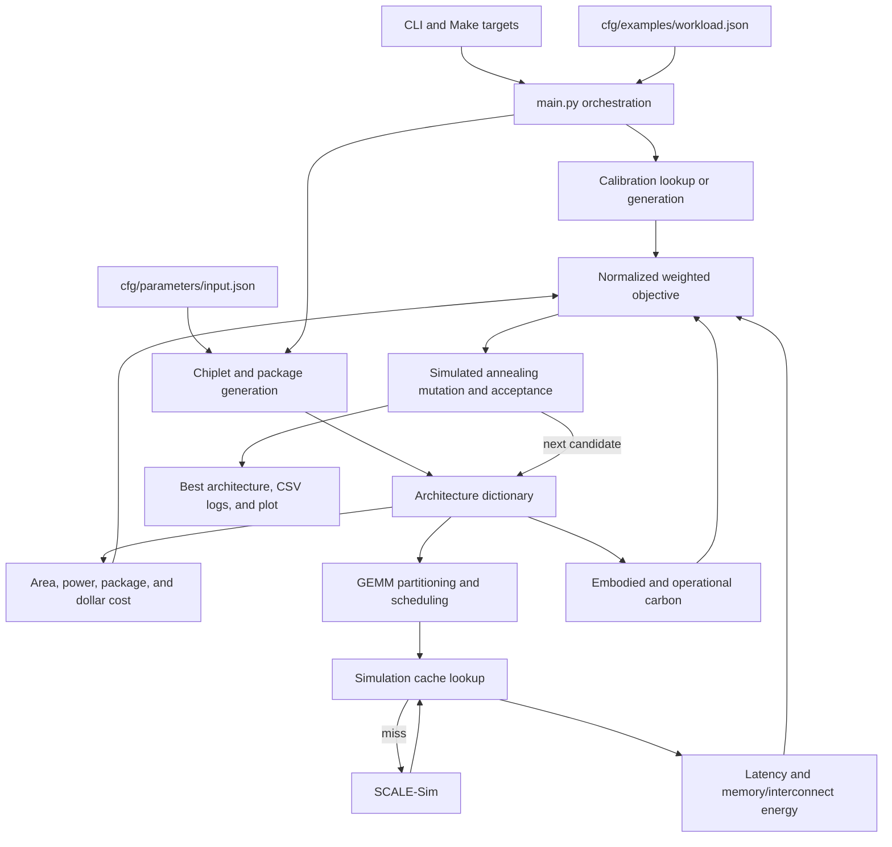

# CarbonPATH Architecture

## Purpose

CarbonPATH is a Python research framework for exploring chiplet-based GEMM
accelerator designs. It searches across workload mappings, systolic-array
configurations, technology nodes, memory systems, package types, and die-to-die
protocols. Each candidate is evaluated for performance, energy, area, dollar
cost, embodied carbon, and operational carbon, then scored with a configurable
weighted objective.

The primary workflow uses simulated annealing to find lower-cost designs. A
separate calibration workflow samples random designs to establish the metric
ranges used during objective normalization.

## Documentation Authority

The live source tree is the authority for this document.
`asu-vda-lab-carbonpath-8a5edab282632443.txt` is a concatenated snapshot of the
upstream GitHub repository at `https://github.com/ASU-VDA-Lab/CarbonPATH`. It is
useful for project provenance and historical context, but its file inventory is
incomplete. In particular, it omits the live `chiplet/n_utils.py` module and the
`cfg/static_cache/static_cache.csv` simulation cache even though both are
required by the current program.

## System Overview



The code has two main modeling layers:

- `chiplet/` generates and mutates architectures, models physical dimensions
  and dollar cost, and connects CarbonPATH to the carbon model.
- `system/` turns an architecture into systolic-array cores, partitions the
  GEMM, invokes or reuses cycle simulation, and aggregates latency and energy.

`main.py` coordinates both layers and owns calibration and simulated annealing.

## Entry Points

### Primary CLI

Run the framework from the repository root:

```bash
python -m main --workload 1 --run_mode run_sim_anneal --cost_profile t1
```

The implemented run modes are:

- `run_sim_anneal`: calibrate or load calibration, generate an initial design,
  run simulated annealing, and write design-space exploration results.
- `run_calibration`: sample random designs and write workload-specific metric
  statistics when calibration data does not already exist.
- `run_policy_compare`: evaluate all intermediate-memory policies on one
  architecture and write their latency, energy, and objective comparison.

### Make Targets

- `make run`: invoke `python -m main` with configurable workload, mode, and
  profile.
- `make sim_anneal`: run simulated annealing.
- `make calibration`: run calibration.
- `make clean_calibration`: delete generated calibration JSON and CSV files.
- `make parallel_calibration`: launch calibration for multiple workloads.
- `make parallel_carbonpath`: launch all configured workload/profile pairs.
- `make clean_all`: remove selected root-level run logs and simulation folders.

### Utility Scripts

- `script/run_parallel_carbonpath.sh` launches workloads 1 through 6 for cost
  profiles `t1` through `t4`, gives each workload a cache copy, redirects each
  process to a log, and kills jobs whose logs stop changing.
- `script/run_parallel_calibration.sh` performs the equivalent parallel launch
  for calibration jobs.
- `script/clean_calibration.py` removes `calibration_*.json` and
  `calibration_*.csv` from `cfg/calibration/`.

## Input Contracts

### Command-Line Inputs

`main.py` accepts:

| Argument | Meaning | Default |
| --- | --- | --- |
| `--workload` | Numeric key selecting a GEMM or ordered sequence | `1` |
| `--iteration` | Number of complete optimization/calibration runs | `1` |
| `--run_name` | Label included in simulator and result directories | empty |
| `--cache_file` | Persistent SCALE-Sim latency cache | `cfg/static_cache/static_cache.csv` |
| `--cost_profile` | Objective weighting profile (`t1`-`t4`) | `t1` |
| `--run_mode` | `run_sim_anneal`, `run_calibration`, or `run_policy_compare` | `run_sim_anneal` |
| `--intermediate_policy` | Boundary policy for ordered GEMMs | `direct_forward` |
| `--architecture_file` | Fixed architecture required by `run_policy_compare` | none |

### GEMM Workload

`cfg/examples/workload.json` supports legacy `[M, K, N]` integer triples and
canonical ordered objects containing at least two GEMMs. `parse_workload_entry()`
normalizes both forms into a named list of GEMMs. Adjacent GEMMs are chained:
they must have the same M dimension and each next K dimension must equal the
previous N dimension.

Sequences execute GEMMs in order with no pipelining or compute overlap. Under
the default `direct_forward` policy, same-core slices remain in SRAM and remote
slices use valid chiplet routes. An infeasible boundary falls back entirely to
DRAM. Explicit policies can instead require cold DRAM, same-core SRAM retention,
or ideal on-chip transfer. The first input and final output always access DRAM.

### Design Search Space

`cfg/parameters/input.json` defines:

- maximum number of chiplets;
- allowed systolic-array sizes;
- allowed process technology nodes;
- valid SRAM sizes for each array size;
- available 2D, 2.5D, and 3D interconnect technologies;
- available die-to-die protocols;
- available DDR and HBM memory technologies.

The architecture generator randomly selects values from this search space.
Mutations during simulated annealing use the same allowed values.

### Internal Architecture Schema

Candidate and result architectures are dictionaries with three sections:

```json
{
  "Chiplet_1": {
    "tech_node": "10",
    "sys_array_size": "64x64",
    "sram_buf": 512,
    "area": 0.74,
    "power": 1.38
  },
  "pkg": {
    "HI_pkg_type": "2d",
    "inter_pkg_conn": "2d_na",
    "protocol_3d": "na",
    "protocol_2.5d": "na",
    "mem_pkg_conn": {
      "mem_type": "ddr5",
      "Chiplet_1": 8
    }
  },
  "WL_mapping": {
    "mapping": {
      "chiplet_data_sharing_enabled": 0,
      "if_splitting_k": 0,
      "dataflow": ["os"],
      "assign_workload_in_ascending_order": 0,
      "static_tiling": 0,
      "merge_tiles": 0
    }
  }
}
```

There may be multiple `Chiplet_N` entries. Package connections are records with
`from`, `to`, `connection_type`, and `loc` fields. The architecture examples in
`cfg/gen_arch/temp_example/` illustrate 2.5D, 3D, and hybrid 2.5D+3D forms, but
the primary CLI generates architectures rather than accepting an example file.

### Calibration Data

`cfg/calibration/calibration_<workload>.json` stores average, minimum, maximum,
mean, median, and standard deviation values for:

- total energy;
- latency;
- package area;
- dollar cost;
- embodied carbon;
- operational carbon.

The active normalization strategy is selected in `config.py`. The checked-in
configuration uses `min_median`. Existing calibration JSON is loaded directly;
to regenerate it, the old calibration files must first be removed.

### Simulation Cache

`cfg/static_cache/static_cache.csv` is both an input and an output. Its key and
value columns are:

```text
core_size,data_flow,bandwidth,buffer_size,M,K,N,latency
```

The first seven columns identify a unique systolic-array/GEMM simulation. The
`latency` column stores the resulting cycle count. Cache misses invoke
SCALE-Sim, add rows in memory, and are persisted at the end of simulated
annealing.

### Model Parameters

The parameter JSON files are lookup tables, not executable configuration:

- `base_spec_7nm.json`: baseline logic area and power by array size.
- `base_spec_sram_7nm.json`: baseline SRAM area and energy by capacity.
- `scaling.json`: logic area and power scaling by technology node.
- `sram_scaling.json`: SRAM area and energy scaling by technology node.
- `sram_energy.json`: analytical SRAM access-energy lookup and node scaling.
- `freq_scale.json`: base clock and frequency scaling by technology node.
- `mem_bw.json`: memory bandwidth by memory type and array size.
- `energy_eff.json`: DRAM and die-to-die energy per bit.
- `d2d_input.json`: protocol data rates, efficiency, and package pitch.
- `bonding_yield.json`: bonding yield by package technology.
- `cost_profiles.json`: weights for the six normalized objective terms.

## Runtime Flow

### 1. Startup and Workload Selection

`main.py`, `ChipletSystem.py`, and `Scheduler.py` load several JSON tables at
module import time. The CLI chooses one workload and constructs the output run
name. Most paths are relative to the repository root, so the current working
directory is part of the runtime contract.

### 2. Calibration

Before optimization, `get_calib_cost_avg()` looks for
`cfg/calibration/calibration_<workload>.json`.

- If it exists, the statistics are loaded.
- Otherwise, CarbonPATH repeatedly generates random systems, evaluates their
  raw metrics, computes aggregate statistics, and writes calibration JSON and
  CSV files.

These statistics put metrics with different units and scales onto comparable
ranges before weighting.

### 3. Architecture Generation

`SystemGenerator` composes three generators from `chiplet/n_disagg.py`:

- `ChipletGenerator` chooses the chiplet count, array size, technology node,
  and SRAM capacity, then derives area and power.
- `PackageGenerator` chooses 2D, 2.5D, 3D, or hybrid packaging; builds valid 3D
  stacks; selects compatible protocols; and distributes memory channels.
- `WLMappingGenerator` chooses K splitting, dataflow, assignment order, and
  tiling controls.

The floorplanning helpers in `chiplet/n_utils.py` estimate package dimensions,
identify neighboring chiplets, and update 2.5D links to match the resulting
layout. Invalid stack combinations are retried.

### 4. Network Front End

`system/utils/NetworkWorkload.py` defines schema version 1 for sequential pure
linear networks. A network declares an `int8` input tensor with batch and
feature dimensions followed by ordered linear layers with output feature
counts. The compiler converts each layer into the existing canonical GEMM
representation, carrying each output feature count into the next layer's input
feature count. This keeps network execution on the validated GEMM scheduling
and memory-policy path rather than introducing a second simulator.

`network.py` exposes four modes:

- `validate` parses and compiles a network without simulation;
- `evaluate` simulates one fixed architecture and emits long-form results;
- `compare-memory` evaluates the explicit memory policies on one unchanged
  architecture;
- `calibrate` samples the existing architecture search space using the compiled
  network's configured intermediate policy and records normalization bounds.

Calibration files are network-specific. Their identity covers the canonical
network topology, intermediate policy, model version, and architecture search
space. Evaluation rejects a calibration whose identity or fingerprints do not
match. Architecture optimization for a network is intentionally deferred; the
current interface only evaluates explicitly supplied architectures.

The fixed-evaluation artifacts separate aggregation levels: `summary.json`
contains network totals and calibrated objective/carbon values, `layers.csv`
contains one row per linear layer, `boundaries.csv` contains intermediate-memory
placement and transfer decisions, and `mapping.csv` records every scheduled
tile's logical layer and physical core assignment.

### 4a. Parser Workloads and FPGA ReLU (V0)

Alongside the legacy linear-network schema, the front end accepts normalized
parser workloads (`"format": "atlas-normalized-v0"`) produced by an external
ATLAS parser. `system/utils/AtlasWorkload.py` validates a single sequential
chain of `gemm` and `relu` operations with explicit tensor IDs and `int8`
tensors. `network.load_workload` dispatches to this parser or the legacy one
based on the envelope `format`.

Mixed operation sequences are evaluated by `main.simulate_operation_sequence`,
which requires exactly one systolic-array chiplet and one FPGA chiplet. GEMMs
use the existing SCALE-Sim schedulers and cache; ReLU uses an analytical FPGA
estimator. `ChipletSystem` builds a `FpgaChiplet` endpoint for any chiplet
declared with `"chiplet_type": "fpga"` and routes SA-to-FPGA and FPGA-to-SA
transfers through the same weighted interconnect graph used for SA-to-SA
transfers.

The FPGA estimator family lives in `system/utils/NonGemmEstimator.py`:

- `ReluComputeEstimator` derives `parallel_lanes` from the FPGA's CLB/BRAM/DSP
  counts and the declared per-lane ReLU implementation profile, then computes
  `ceil(elements / lanes)` cycles and the compute latency. It never invents a
  lane count and returns an infeasible result when resources yield zero lanes.
- `ReluStageComposer` composes the serialized input transfer, compute, and
  output transfer.
- `NonGemmEstimator` is the facade and operation dispatcher.

`system/utils/TransferEstimator.py` is operation-agnostic: it receives an
already-resolved route and a tensor payload and returns byte count, latency, and
energy. It does not resolve routes or inspect topology.

For `GEMM -> ReLU -> GEMM`, the producing GEMM runs with
`output_to_dram = False` and the consuming GEMM runs with
`activation_from_dram = False`; the ReLU stage owns both transfer legs. This
gives every physical tensor movement exactly one accounting owner. Full details
and the parser contract are in `docs/atlas_fpga_relu_v0.md`.

### 5. GEMM Sequence and Scheduling

`simulate_latency_energy()` loops through the normalized sequence in order. For
each logical GEMM, `simulate_single_gemm()` creates a fresh `GEMMWorkload`,
`ChipletSystem`, `Scheduler`, and set of mutable cores. The immutable candidate
architecture and `SimulationCache` are shared. This state ownership prevents
tiles, capacities, cycle counts, and reductions from crossing GEMM boundaries.

`ChipletSystem` converts each chiplet into a `SystolicArray`, applying:

- technology-dependent frequency;
- SRAM capacity and energy scaling;
- memory bandwidth and DRAM energy;
- inter-chiplet bandwidth and energy weights;
- 3D base/top placement and memory-path adjustments.

`Scheduler.static_workload_scheduling()` partitions M and N according to the
largest minimum core tile. It optionally partitions K, distributes tiles in
proportion to core compute capacity, applies one dataflow to all cores, and can
merge adjacent tiles.

For sequential workloads, `IntermediateMemoryPolicy.py` intersects producer
output regions with consumer activation regions after scheduling. Each boundary
must account for every intermediate byte exactly once. Split-K producer regions
are assigned to the same final reduction owner used by `Scheduler`. Unsupported,
incomplete, or unroutable mappings fall back for the whole boundary rather than
mixing an unverified partial result with another transfer method.

The supported policies are `cold_dram`, `ideal_on_chip`, `local_sram`, and
`direct_forward`. The first input and final output remain DRAM
transactions. Local retention reuses the producer SRAM write and consumer SRAM
read already present in the per-GEMM model, so it adds no duplicate SRAM charge.
Direct forwarding uses the existing route bandwidth reciprocal and energy per
bit. Direct forwarding is the default and falls back to cold DRAM for an invalid
mapping, insufficient destination SRAM, or a missing route.

### 6. Cycle Simulation and Energy

`SimulationCache` looks up every scheduled core/tile combination. On a miss,
`Simulator` writes a SCALE-Sim configuration and GEMM workload CSV, runs
SCALE-Sim, reads the generated report, and updates the in-memory cache.

`Scheduler.system_modeling()` combines:

- DRAM input and output transfer latency and energy;
- cached or simulated compute cycles converted using each core frequency;
- die-to-die transfer latency and energy when K is split;
- reduction latency for partial output tiles;
- final DRAM writeback;
- analytical SRAM energy.

Each GEMM returns end-to-end latency, communication/DRAM energy, and SRAM
energy. Sequence latency and both energy categories are summed. Area, dollar
cost, and embodied carbon are architecture-level values and are calculated only
once. Operational carbon is calculated from sequence-total energy.

The current total-energy model includes `system power * latency`, so transfer
latency changes also change the reported compute-energy term. Policy reports
therefore expose direct boundary transfer energy separately from this secondary
power-times-latency effect.

### Capacity Validation

`script/validate_intermediate_memory_capacity.py` provides a deterministic
end-to-end check of the SRAM capacity boundary without adding artificial search
workloads or requiring calibration. It constructs one supported 64x64, 7 nm
core with a nominal 256 KiB policy capacity and executes paired two-GEMM sequences whose
intermediates are exactly 256 KiB and 256 KiB plus 512 bytes.

Because there is one core, placement is fixed and configured capacity is the
only reason a local request can fail. Expected policy latency is calculated
from the measured cold compute baseline and a separate DRAM boundary
calculation:

```text
boundary_latency = bytes / producer_DRAM_bandwidth
                 + bytes / consumer_DRAM_bandwidth

boundary_energy = 8 * bytes * (producer_DRAM_energy_per_bit
                               + consumer_DRAM_energy_per_bit)
```

The fit case must retain the complete intermediate and match ideal-on-chip
latency. The overflow case must fall back for the whole boundary, report twice
the intermediate size as DRAM traffic, and match cold-DRAM latency. The command
returns a failure status if methods, accounting, latency, or energy violate
these expectations.

This is a paired policy-accounting validation rather than an external hardware
validation: common errors in the underlying bandwidth or DRAM parameters would
not be detected. The capacity check also uses the configured nominal SRAM size
as the intermediate budget; concurrent occupancy by activations, weights, and
outputs is outside the current policy model. The default command uses an empty
temporary cache so all four unique GEMMs execute through SCALE-Sim.

### 7. Physical Cost and Carbon

`chiplet/n_utils.py` computes:

- total chiplet power;
- package footprint from the recursive floorplan;
- wafer and die costs using process-node cost and yield assumptions;
- interposer and bonding cost;
- DDR/HBM cost uplift;
- operational carbon from compute, SRAM, and communication energy.

`build_design_tables()` adapts the candidate architecture into pandas tables
for the carbon subsystem. `chiplet/carbon_model/ECO_chip.py` combines those
tables with design, package, and technology parameters. `CO2_func.py` performs
manufacturing, design, packaging, yield, wafer-waste, and operational-carbon
equations. CarbonPATH uses the returned manufacturing plus design result as
embodied carbon and computes its own operational-carbon objective separately.

### 8. Objective Calculation

`calculate_system_normalized_metrics()` combines six terms:

- energy;
- latency;
- area;
- dollar cost;
- embodied carbon;
- operational carbon.

Each term is normalized using calibration statistics, scaled by its observed
range, weighted with the selected `t1`-`t4` profile, and summed. Lower scores
are preferred. Carbon remains calculated and reported, but the current carbon
coefficients are zero and therefore make no score contribution.

### 9. Simulated Annealing

Each annealing move mutates either workload mapping or architecture. Supported
architecture mutations include chiplet count, array size, technology node,
memory type, package type, SRAM capacity, and protocol. Improving moves are
always accepted. Worse moves can be accepted according to
`exp(-cost_difference / temperature)`. The temperature is reduced after each
batch until it reaches the freezing threshold.

The CLI currently overrides the function defaults and runs with temperature
`40`, five moves per temperature, cooling rate `0.3`, and ten requested
calibration samples. These values differ from those described in `README.md`.

## Output Contracts

### Optimization Results

`dump_results()` creates:

```text
cfg/gen_arch/<run-name>/
├── best_arch_<run-name>_<timestamp>.json
├── cost_v_iteration_<run-name>_<timestamp>.png
├── sa_arch_detail_<run-name>_<timestamp>.csv
└── sa_metrics_<run-name>_<timestamp>.csv
```

- `best_arch_*.json` contains the selected chiplets, package, memory mapping,
  links, protocols, and workload mapping.
- `sa_metrics_*.csv` records each attempted move, acceptance decision, scalar
  cost, normalized contributions, raw sequence totals, and per-GEMM latency and
  energy metrics.
- `sa_arch_detail_*.csv` contains flattened candidate architecture fields for
  each attempted move.
- `cost_v_iteration_*.png` plots the logged cost over annealing attempts.

### Other Generated Outputs

- `cfg/calibration/calibration_<workload>.json`: reusable normalization data.
- `cfg/calibration/calibration_<workload>.csv`: per-sample calibration details.
- `cfg/static_cache/*.csv`: persistent or parallel-job simulation caches.
- `<run-name>/Core<ID>_<width>_<height>/`: SCALE-Sim input and report files.
- `log_wl*.log`, `job_success.log`, and `job_stalled.log`: parallel-run logs.
- `__pycache__/` and `*.pyc`: generated Python bytecode, not source code.

## Repository Map

### Root Files

- `README.md`: installation, configuration, execution, and result overview.
  Some paths and runtime values are stale relative to the current source.
- `architecture.md`: this architectural and data-flow reference.
- `main.py`: CLI, workload selection, calibration, candidate evaluation,
  simulated annealing, and result orchestration.
- `config.py`: global switches for SRAM selection, metric normalization,
  diagnostic printing, fast simulation, and latency modeling.
- `Makefile`: convenience targets for single and parallel workflows.
- `requirements.txt`: pinned Python dependencies, including NumPy, pandas,
  Matplotlib, tqdm, and SCALE-Sim.
- `asu-vda-lab-carbonpath-8a5edab282632443.txt`: incomplete upstream GitHub
  context snapshot; it is documentation/context rather than runtime input.

### `chiplet/`

- `chiplet/__init__.py`: package marker.
- `chiplet/n_disagg.py`: random chiplet, package, memory-channel, protocol, and
  workload-mapping generation.
- `chiplet/n_utils.py`: central physical/search utility module. It contains
  scaling lookups, floorplanning, cost calculations, objective normalization,
  all annealing mutations, topology rebuilding, bandwidth calculations,
  operational carbon conversion, result serialization, and carbon-model table
  construction.

### `chiplet/carbon_model/`

- `__init__.py`: package marker.
- `ECO_chip.py`: loads carbon-model parameters and exposes `find_carbon()`.
- `CO2_func.py`: silicon manufacturing, design, packaging, yield, wastage, and
  operational-carbon equations.
- `tech_scaling.py`: converts technology-scaling JSON arrays into pandas lookup
  tables.

Architecture-level carbon parameters:

- `arch_params/architecture.json`: fallback standalone carbon-model design.
- `arch_params/designC.json`: design iterations, production volume, gates, and
  carbon assumptions.
- `arch_params/operationalC.json`: default modeled operating lifetime.
- `arch_params/packageC.json`: interposer node, layer counts, pitches, feature
  sizes, and back-end-of-line assumptions.

Technology-scaling tables:

- `tech_params/analog_scaling.json`: analog area scaling.
- `tech_params/beol_feol_scaling.json`: front-end/back-end manufacturing data.
- `tech_params/cpa_scaling.json`: carbon-per-area scaling.
- `tech_params/defect_density.json`: process defect-density values.
- `tech_params/dyn_pwr_scaling.json`: dynamic-power scaling.
- `tech_params/gates_perhr_scaling.json`: design-productivity scaling.
- `tech_params/logic_scaling.json`: logic scaling factors.
- `tech_params/sram_scaling.json`: carbon-model SRAM scaling factors.
- `tech_params/transistors_scaling.json`: transistor-density scaling.

### `system/`

- `system/__init__.py`: package marker.
- `system/utils/__init__.py`: utility-package marker.
- `system/utils/GEMMWorkload.py`: GEMM dimensions, tile offsets, MAC count, and
  assignment state.
- `system/utils/SystolicArray.py`: per-core dimensions, capacity, frequency,
  bandwidth, workload list, cycle counts, and energy scales.
- `system/utils/ChipletSystem.py`: converts architecture dictionaries into
  systolic-array cores and FPGA endpoints plus a weighted interconnect graph,
  finds routes across all endpoints, and adjusts 3D memory paths.
- `system/utils/AtlasWorkload.py`: normalized parser-workload front end for
  sequential `gemm`/`relu` chains.
- `system/utils/FpgaChiplet.py`: FPGA endpoint with resources and a per-lane
  ReLU implementation profile.
- `system/utils/TransferEstimator.py`: resolved-route transfer latency and
  energy for an `int8` tensor payload.
- `system/utils/NonGemmEstimator.py`: ReLU compute estimator, serialized stage
  composer, and non-GEMM operation dispatcher.
- `system/utils/Scheduler.py`: GEMM partitioning, core assignment, optional tile
  merging, DRAM/interconnect/reduction timing, and energy aggregation.
- `system/utils/SimulationCache.py`: indexed CSV lookup, SCALE-Sim miss
  dispatch, in-memory updates, deduplication, and persistence.
- `system/utils/Simulator.py`: SCALE-Sim configuration/workload generation,
  invocation, and report extraction.

### `cfg/`

- `cfg/examples/workload.json`: six legacy GEMM shapes, one chained two-GEMM
  example, and one four-identical-GEMM scaling example.
- `cfg/examples/atlas_gemm_relu_gemm.json`: normalized parser workload with a
  `GEMM -> ReLU -> GEMM` chain.
- `cfg/examples/sa_fpga_architecture.json`: fixed one-SA plus one-FPGA
  architecture with a 2.5D link and a configured ReLU implementation profile.
- `cfg/parameters/`: design-space and physical-model inputs described under
  Model Parameters.
- `cfg/calibration/calibration_1.json` through `calibration_6.json`: checked-in
  normalization statistics for the six legacy workloads. Sequence calibration
  files are generated when those workloads are first run.
- `cfg/static_cache/static_cache.csv`: large precomputed and runtime-mutable
  cycle cache.
- `cfg/gen_arch/temp_example/`: sixteen reference architecture JSON files for
  2.5D, 3D, and hybrid designs with different chiplet arrangements.
- `cfg/gen_arch/<run-name>/`: generated optimization results; these directories
  are artifacts rather than source inputs.

The `25d_*`, `3d_*`, and `55d_*` example filename prefixes mean 2.5D, 3D, and
hybrid 2.5D+3D respectively.

### Supporting Assets

- `script/`: cleanup and parallel-run entry points described above.
- `figs/carbonPath.jpg`: framework overview used by the README.
- `figs/co-design-compute-stack.jpg`: co-design stack illustration.
- `figs/carbon_wl_map.png`: workload-mapping result figure.
- `figs/carbon_scatter.jpg`: package/protocol result figure.
- `paper_results/template_t3_table.jpg`: supplemental template `t3` results.
- `paper_results/template_t4_table.jpg`: supplemental template `t4` results.

## Dependencies and Boundaries

SCALE-Sim is the principal external model. CarbonPATH creates SCALE-Sim inputs
and consumes its cycle reports through the installed `scalesim` Python package.
NumPy and pandas support partitioning, tabular configuration, calibration, and
result processing. Matplotlib creates the annealing plot. There are no network
services, databases, or runtime HTTP APIs.

The parallel scripts additionally require a Unix-like shell with `nohup`,
`stat`, `kill`, `date`, `sleep`, and related utilities.

## Operational Constraints and Known Gaps

- Run commands from the repository root because many modules open `cfg/...`
  paths relative to the current working directory.
- Random generation and mutation are not seeded through the CLI, so identical
  inputs do not guarantee identical results.
- The cache is mutable. Parallel scripts create separate cache copies to avoid
  concurrent writes to one file.
- Calibration mode loads existing JSON instead of replacing it. Use the cleanup
  command before intentionally recalibrating.
- The README states Python 3.9, but current union type annotations require
  Python 3.10 or newer syntax.
- README calibration counts and annealing hyperparameters do not match the
  current values passed by the CLI entry point.
- Generated bytecode is present in version control. `.gitignore` excludes the
  repository-local `.venv` and new bytecode, but tracked bytecode remains.
- Focused standard-library tests cover workload sequences, cache accounting,
  and DRAM write energy. There is no CI workflow or package metadata.
- Some example architecture files reflect older schema variants and should be
  treated as illustrations unless validated against the current constructors.
- Normal execution writes simulator files, result directories, and possibly
  cache updates; it is not a read-only operation.
