# CarbonPATH ATLAS Annealing Flow

```mermaid
flowchart TD
    A["<b>1. INPUT: Keras / HGQ2 network</b><br/><br/>Defines:<br/>• layer and operation sequence<br/>• tensor shapes<br/>• GEMM dimensions<br/>• ReLU / Softmax operations<br/>• quantization configuration"]

    B["<b>2. ATLAS graph-only conversion</b><br/><br/>• converts the Keras model to an hls4ml ModelGraph<br/>• recognizes supported operations<br/>• preserves tensor dependencies and shapes<br/>• stops before code generation or EDA<br/><br/><b>Output:</b> raw ATLAS graph-dump JSON"]

    C["<b>3. FIXED ATLAS workload graph</b><br/><br/>Contains:<br/>• ordered GEMM / ReLU / Softmax operations<br/>• operation dimensions and element counts<br/>• input and output tensor identities<br/>• producer → consumer dependencies<br/><br/><b>Fixed during annealing:</b><br/>operations, shapes, dependencies, and order"]

    D1["<b>4A. Starting architecture</b><br/><br/><b>Systolic array</b><br/>• array size<br/>• technology node<br/>• SRAM capacity<br/>• area and power<br/><br/><b>FPGA</b><br/>• CLBs, BRAMs, DSPs<br/>• frequency<br/>• ReLU implementation<br/><br/><b>Package</b><br/>• SA ↔ FPGA routes<br/>• DDR5 / HBM2 / HBM3<br/>• UCIe / AIB protocol<br/><br/><b>Transfer parameters</b><br/>• setup latency<br/>• per-hop latency"]

    D2["<b>4B. Starting evaluation profile</b><br/><br/><b>Placement policy</b><br/>• decides whether each operation uses SA or FPGA<br/><br/><b>Movement policy</b><br/>• decides whether tensors stay resident or cross endpoints<br/><br/><b>Transfer model</b><br/>• calculates movement latency and energy<br/><br/><b>Operation evaluators</b><br/>• GEMM evaluator<br/>• ReLU evaluator<br/>• Softmax evaluator"]

    D3["<b>4C. Search and annealing configuration</b><br/><br/><b>Search space</b><br/>• allowed values for every architecture knob<br/>• candidate evaluation profiles<br/><br/><b>Objective</b><br/>• weights latency, energy, area, cost, and carbon<br/>• produces one scalar cost<br/><br/><b>Schedule</b><br/>• initial temperature<br/>• moves per temperature<br/>• cooling rate<br/>• stopping condition"]

    E["<b>5. Evaluate the starting design point</b><br/><br/>Starting design = architecture + profile<br/><br/>For every graph operation:<br/>1. placement policy selects SA or FPGA<br/>2. movement policy checks previous tensor location<br/>3. transfer model prices any SA ↔ FPGA movement<br/>4. selected evaluator calculates compute latency and energy<br/><br/>Then calculate totals:<br/>• latency and energy<br/>• power, area, and dollar cost<br/>• embodied and operational carbon<br/>• scalar objective cost<br/><br/><b>Initialize:</b> current = starting design; best = starting design"]

    F["<b>6. Create one candidate</b><br/><br/>Copy the currently accepted architecture and profile.<br/><br/><b>Randomly change exactly one move category:</b><br/>• SA array size<br/>• SA technology node<br/>• SA SRAM size<br/>• FPGA CLBs<br/>• FPGA BRAMs<br/>• FPGA DSPs<br/>• FPGA frequency<br/>• FPGA ReLU implementation<br/>• package memory type<br/>• package communication protocol<br/>• numeric transfer parameters<br/>• complete evaluation profile<br/><br/>The ATLAS workload graph does not change."]

    G["<b>7. Validate and evaluate candidate</b><br/><br/><b>Validate:</b><br/>• exactly one systolic array<br/>• exactly one FPGA<br/>• selected values belong to the search space<br/><br/><b>Re-run the complete graph evaluation:</b><br/>placement → movement → transfer → operation evaluator<br/><br/><b>Output:</b><br/>candidate metrics, candidate cost, and<br/>cost difference = candidate cost − current cost"]

    H{"<b>8. Accept candidate?</b><br/><br/>If candidate cost is lower:<br/>accept it<br/><br/>Otherwise:<br/>accept with probability<br/>exp(−cost difference / temperature)"}

    I["<b>9A. Accepted</b><br/><br/>• candidate becomes current design<br/>• next mutation starts from this candidate<br/>• if candidate beats best cost,<br/>  also replace best architecture and best profile"]

    J["<b>9B. Rejected</b><br/><br/>• current architecture remains unchanged<br/>• current profile remains unchanged<br/>• next mutation starts from the previous current design<br/>• best design remains unchanged"]

    K["<b>10. Record and advance schedule</b><br/><br/>Record:<br/>• selected mutation<br/>• candidate metrics and cost<br/>• accepted or rejected<br/>• current cost before and after<br/>• best cost before and after<br/><br/>After all moves at this temperature:<br/>• reduce or adapt temperature<br/>• repeat from candidate creation<br/><br/>Stop when frozen or move budget is exhausted."]

    L["<b>11. OUTPUT</b><br/><br/>• best architecture JSON<br/>• best evaluation profile JSON<br/>• best scalar objective cost<br/>• per-move annealing trace CSV<br/>• architecture trace CSV<br/>• updated simulation cache<br/><br/>Returns the best-ever design,<br/>not necessarily the final current design."]

    A --> B --> C
    C --> D1
    C --> D2
    C --> D3
    D1 --> E
    D2 --> E
    D3 --> E
    E --> F --> G --> H
    H -- Yes --> I --> K
    H -- No --> J --> K
    K -- Continue --> F
    K -- Finished --> L

    classDef input fill:#e8f1ff,stroke:#2b66b1,color:#17202a,stroke-width:2px;
    classDef tune fill:#fff1ce,stroke:#9a6100,color:#17202a,stroke-width:2px;
    classDef process fill:#e8f7ef,stroke:#237348,color:#17202a,stroke-width:2px;
    classDef decision fill:#f2eaff,stroke:#6c43a2,color:#17202a,stroke-width:2px;
    classDef output fill:#fde9e4,stroke:#a83d27,color:#17202a,stroke-width:2px;

    class A,C input;
    class D1,D2,D3,F tune;
    class B,E,G,I,J,K process;
    class H decision;
    class L output;
```

## Color key

- Blue: fixed workload input
- Yellow: tunable design or search choices
- Green: processing and state updates
- Purple: acceptance decision
- Red: final outputs
